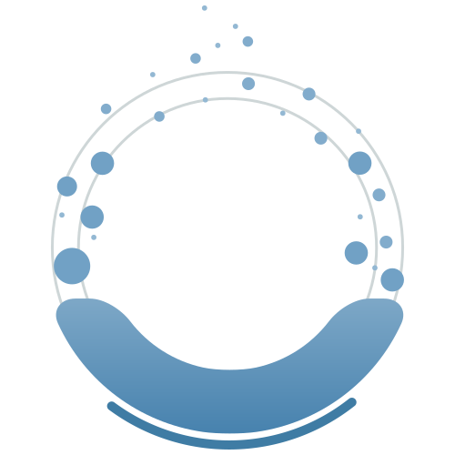
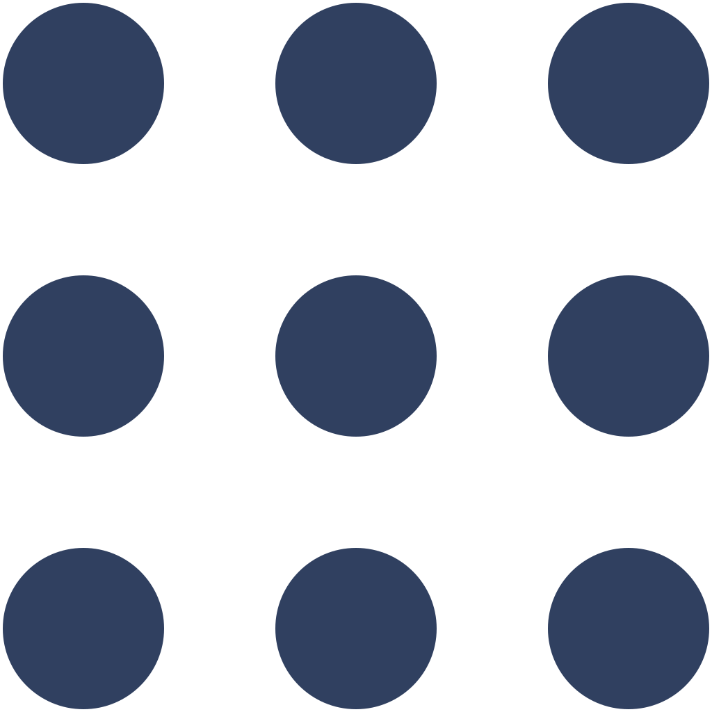
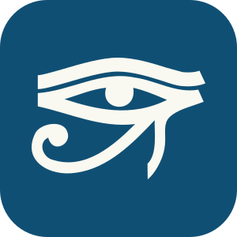

# static

<table align="center">
  <thead>
    <tr>
      <th rowspan="1" colspan="1" align="center" style="text-align: center; vertical-align: middle;">File Name</th>
      <th rowspan="1" colspan="1" align="center" style="text-align: center; vertical-align: middle;">Preview</th>
      <th rowspan="1" colspan="1" align="center" style="text-align: center; vertical-align: middle;">Source</th>
      <th rowspan="1" colspan="1" align="center" style="text-align: center; vertical-align: middle;">Attribution</th>
    </tr>
  </thead>
  <tbody>
    <tr>
      <td><code>mark/appimage.svg</code></td>
      <td></td>
      <td><a href="https://github.com/AppImage/docs.appimage.org/blob/master/source/_static/img/appimage.svg">Link</a></td>
      <td></td>
    </tr>
    <tr>
      <td><code>mark/breathe.svg</code></td>
      <td></td>
      <td><a href="https://github.com/breathe-doc/breathe/blob/main/documentation/source/_static/logo.svg">Link</a></td>
      <td></td>
    </tr>
    <tr>
      <td><code>mark/cmake.svg</code></td>
      <td></td>
      <td><a href="https://commons.wikimedia.org/wiki/File:Cmake.svg">Link</a></td>
      <td>
        By <a href="https://cmake.org/">CMake Team</a>, licensed under <a href="https://creativecommons.org/licenses/by/4.0/">CC BY 4.0</a>.
      </td>
    </tr>
    <tr>
      <td><code>mark/colcon-blue.svg</code></td>
      <td></td>
      <td><a href="https://github.com/colcon/.github/blob/b6644eb743865342c67eef1cf7bfd9f11adf3733/workflow-templates/colcon.svg">Link</a></td>
      <td></td>
    </tr>
    <tr>
      <td><code>mark/colcon-white.svg</code></td>
      <td></td>
      <td><a href="https://github.com/colcon/.github/blob/b6644eb743865342c67eef1cf7bfd9f11adf3733/workflow-templates/colcon.svg">Link</a></td>
      <td></td>
    </tr>
    <tr>
      <td><code>mark/conan.svg</code></td>
      <td></td>
      <td><a href="https://www.svgrepo.com/svg/353596/conan-io/">Link</a></td>
      <td></td>
    </tr>
    <tr>
      <td><code>mark/crowdin-dark.svg</code></td>
      <td></td>
      <td><a href="https://support.crowdin.com/using-logo/">Link</a></td>
      <td></td>
    </tr>
    <tr>
      <td><code>mark/crowdin-white.svg</code></td>
      <td></td>
      <td><a href="https://support.crowdin.com/using-logo/">Link</a></td>
      <td></td>
    </tr>
    <tr>
      <td><code>mark/flatpak.svg</code></td>
      <td></td>
      <td><a href="https://en.m.wikipedia.org/wiki/File:Flatpak_Logo.svg">Link</a></td>
      <td></td>
    </tr>
    <tr>
      <td><code>mark/linux.svg</code></td>
      <td></td>
      <td><a href="https://en.m.wikipedia.org/wiki/File:Tux.svg">Link</a></td>
      <td></td>
    </tr>
    <tr>
      <td><code>mark/llvm.svg</code></td>
      <td></td>
      <td><a href="https://techicons.dev/icons/llvm">Link</a></td>
      <td></td>
    </tr>
    <tr>
      <td><code>mark/mdbook-black.svg</code></td>
      <td></td>
      <td><a href="https://icon-icons.com/icon/mdbook-logo/247757">Link</a></td>
      <td></td>
    </tr>
    <tr>
      <td><code>mark/mdbook-white.svg</code></td>
      <td></td>
      <td><a href="https://icon-icons.com/icon/mdbook-logo/247757">Link</a></td>
      <td></td>
    </tr>
    <tr>
      <td><code>mark/numpy.svg</code></td>
      <td></td>
      <td><a href="https://seeklogo.com/vector-logo/398690/numpy">Link</a></td>
      <td></td>
    </tr>
    <tr>
      <td><code>mark/python.svg</code></td>
      <td></td>
      <td><a href="https://github.com/python/cpython/blob/main/PC/icons/logo.svg">Link</a></td>
      <td></td>
    </tr>
    <tr>
      <td><code>mark/readthedocs-dark.svg</code></td>
      <td></td>
      <td><a href="https://brand-guidelines.readthedocs.org/branding.html">Link</a></td>
      <td></td>
    </tr>
    <tr>
      <td><code>mark/readthedocs-light.svg</code></td>
      <td></td>
      <td><a href="https://brand-guidelines.readthedocs.org/branding.html">Link</a></td>
      <td></td>
    </tr>
    <tr>
      <td><code>mark/ros-dark.svg</code></td>
      <td></td>
      <td><a href="https://github.com/ros-infrastructure/artwork/blob/master/orgunits/ros.svg">Link</a></td>
      <td></td>
    </tr>
    <tr>
      <td><code>mark/ros-white.svg</code></td>
      <td></td>
      <td><a href="https://github.com/ros-infrastructure/artwork/blob/master/orgunits/ros.svg">Link</a></td>
      <td></td>
    </tr>
    <tr>
      <td><code>mark/mark/rust.svg</code></td>
      <td></td>
      <td><a href="https://github.com/rust-lang/rust-artwork/blob/master/logo/rust-logo-blk.svg">Link</a></td>
      <td></td>
    </tr>
    <tr>
      <td><code>mark/sphinx-dark.svg</code></td>
      <td></td>
      <td><a href="https://github.com/sphinx-doc/sphinx/blob/master/doc/_themes/sphinx13/static/sphinx-logo.svg">Link</a></td>
      <td></td>
    </tr>
    <tr>
      <td><code>mark/sphinx-design.svg</code></td>
      <td></td>
      <td><a href="https://github.com/executablebooks/sphinx-design/blob/main/docs/_static/logo_square.svg">Link</a></td>
      <td></td>
    </tr>
    <tr>
      <td><code>mark/setuptools.svg</code></td>
      <td></td>
      <td><a href="https://github.com/pypa/setuptools/blob/main/docs/images/logo-symbol-only.svg">Link</a></td>
      <td></td>
    </tr>
    <tr>
      <td><code>mark/sphinx-white.svg</code></td>
      <td></td>
      <td><a href="https://github.com/sphinx-doc/sphinx/blob/master/doc/_themes/sphinx13/static/sphinx-logo.svg">Link</a></td>
      <td></td>
    </tr>
    <tr>
      <td><code>mark/sphinx.svg</code></td>
      <td></td>
      <td><a href="https://github.com/sphinx-doc/sphinx/blob/master/doc/_themes/sphinx13/static/sphinx-logo.svg">Link</a></td>
      <td></td>
    </tr>
  </tbody>
</table>
