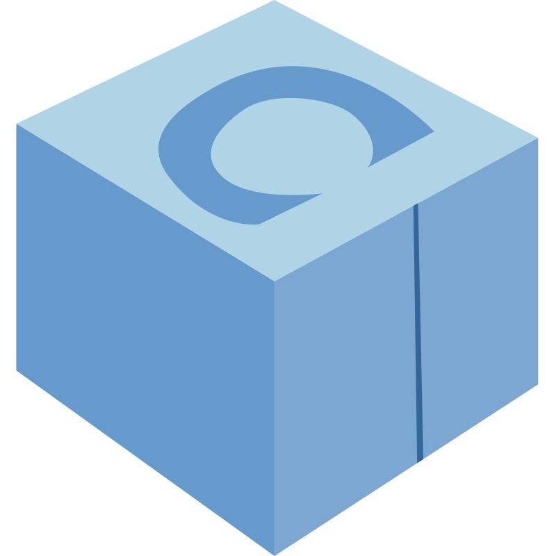
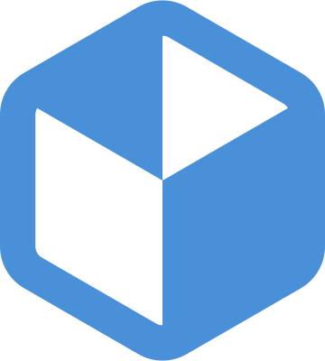

# static

<table align="center">
  <thead>
    <tr>
      <th rowspan="1" colspan="1" align="center" style="text-align: center; vertical-align: middle;">File Name</th>
      <th rowspan="1" colspan="1" align="center" style="text-align: center; vertical-align: middle;">Preview</th>
      <th rowspan="1" colspan="1" align="center" style="text-align: center; vertical-align: middle;">Source</th>
      <th rowspan="1" colspan="1" align="center" style="text-align: center; vertical-align: middle;">Attribution</th>
    </tr>
  </thead>
  <tbody>
    <tr>
      <td>appimage.svg</td>
      <td></td>
      <td><a href="https://github.com/AppImage/docs.appimage.org/blob/master/source/_static/img/appimage.svg">Link</a></td>
      <td></td>
    </tr>
    <tr>
      <td>cmake.svg</td>
      <td></td>
      <td><a href="https://commons.wikimedia.org/wiki/File:Cmake.svg">Link</a></td>
      <td>
        By <a href="https://cmake.org/">CMake Team</a>, licensed under <a href="https://creativecommons.org/licenses/by/4.0/">CC BY 4.0</a>.
      </td>
    </tr>
    <tr>
      <td>conan.svg</td>
      <td></td>
      <td><a href="https://www.svgrepo.com/svg/353596/conan-io/">Link</a></td>
      <td></td>
    </tr>
    <tr>
      <td>crowdin-dark.svg</td>
      <td></td>
      <td><a href="https://support.crowdin.com/using-logo/">Link</a></td>
      <td></td>
    </tr>
    <tr>
      <td>crowdin-white.svg</td>
      <td></td>
      <td><a href="https://support.crowdin.com/using-logo/">Link</a></td>
      <td></td>
    </tr>
    <tr>
      <td>flatpak.svg</td>
      <td></td>
      <td><a href="https://en.m.wikipedia.org/wiki/File:Flatpak_Logo.svg">Link</a></td>
      <td></td>
    </tr>
    <tr>
      <td>linux.svg</td>
      <td></td>
      <td><a href="https://en.m.wikipedia.org/wiki/File:Tux.svg">Link</a></td>
      <td></td>
    </tr>
    <tr>
      <td>numpy.svg</td>
      <td></td>
      <td><a href="https://seeklogo.com/vector-logo/398690/numpy">Link</a></td>
      <td></td>
    </tr>
    <tr>
      <td>python.svg</td>
      <td></td>
      <td><a href="https://github.com/python/cpython/blob/main/PC/icons/logo.svg">Link</a></td>
      <td></td>
    </tr>
    <tr>
      <td>readthedocs-dark.svg</td>
      <td></td>
      <td><a href="https://brand-guidelines.readthedocs.org/branding.html">Link</a></td>
      <td></td>
    </tr>
    <tr>
      <td>readthedocs-light.svg</td>
      <td></td>
      <td><a href="https://brand-guidelines.readthedocs.org/branding.html">Link</a></td>
      <td></td>
    </tr>
    <tr>
      <td>ros.svg</td>
      <td></td>
      <td><a href="https://github.com/ros-infrastructure/artwork/blob/master/orgunits/ros.svg">Link</a></td>
      <td></td>
    </tr>
    <tr>
      <td>rust.svg</td>
      <td></td>
      <td><a href="https://en.m.wikipedia.org/wiki/File:Rust_programming_language_black_logo.svg">Link</a></td>
      <td></td>
    </tr>
  </tbody>
</table>
